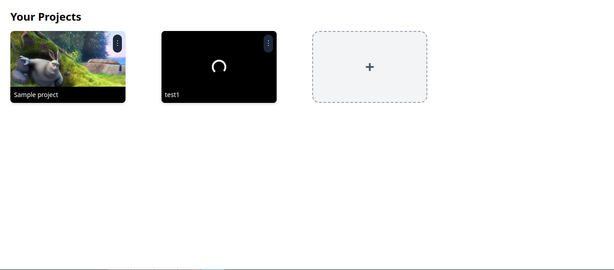
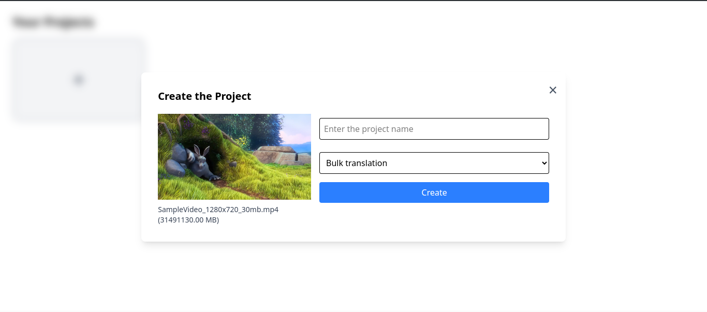
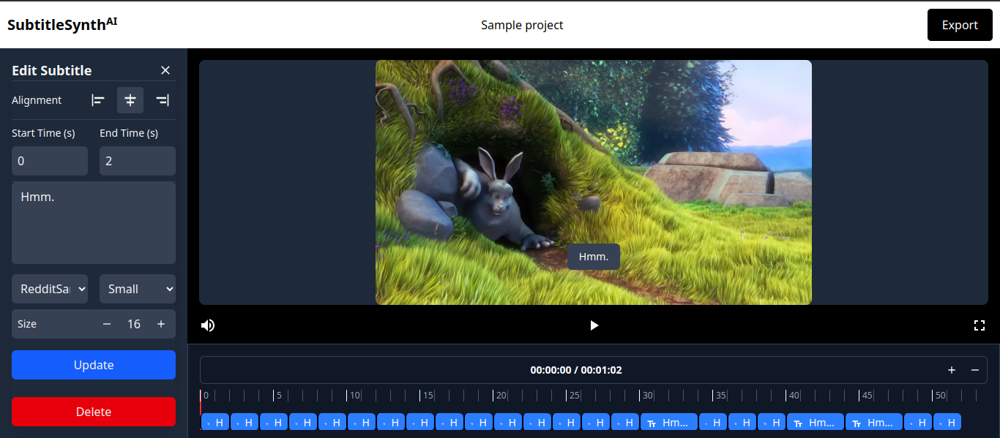

# Subtitle Generation UI

## Overview
This project is a **React-based** user interface for the Subtitle Generation Server. It provides an intuitive frontend for uploading media files, monitoring processing status, and downloading subtitles.

## Features
- Upload video files for subtitle generation.
- View real-time processing status.
- Download subtitles in SRT formats.
- Responsive design using Tailwind CSS.

## Technologies Used
- **React** - Frontend library for building UI components.
- **Tailwind CSS** - Utility-first CSS framework for styling.
- **React Router** - Navigation and routing.

## Installation
### Prerequisites
- Node.js 16+

### Steps
1. Clone the repository:
   ```sh
   git clone https://github.com/rohitkdl913/synthui.git
   cd synthui
   ```
2. Install dependencies:
   ```sh
   npm install
   ```

## Usage
### Running the Development Server
```sh
npm run dev
```

## Screenshots
Below is a screenshot of the UI:





## API Integration
Update VITE_TRANSLATION_SERVER_URL env variable to configure API endpoints.

## Deployment
Build the production-ready UI with:
```sh
npm run build
```


## License
MIT License.

## Contribution
Contributions are welcome! Feel free to open an issue or submit a pull request.

## Contact
For support, email: `kandelsaugat913@gmail.com`

